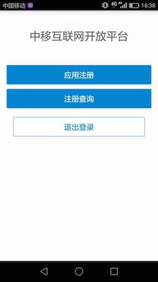
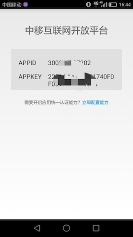

# 项目背景

中国移动统一认证中间件面向客户端应用／插件提供用户认证服务。用户在终端设备上，一次认证即可自由登录所有业务。在插有中国移动SIM卡的终端上，中间件可以利用网络和SIM卡能力提供自动登录服务，登录过程对终端用户来说几乎无感知。 终端应用／插件可通过集成统一认证SDK调用中间件能力，减少开发者的开发难度。

# 项目介绍
## 1.1什么是统一认证iOS SDK
统一认证 iOS SDK是一套基于iOS设备的应用程序接口， 您可以通过该接口实现丰富的注册、登录等功能。 自动登录（一键登录）：无需用户输入用户名密码，自动完成本机号码登录。 手工登录：用户使用短信验证码或用户名密码实现登录。
## 1.2本文面向的读者
统一认证SDK是提供给具有一定iOS编程经验和了解面向对象概念的读者使用。您在使用中遇到任何问题，都可以通过对应接口人反馈给我们。

## 1.3.兼容性
支持iOS8.0版本及以上系统。
## 1.4开发语言
纯Objective-c开发

# 2.1	申请密钥

在使用统一认证SDK为您提供的各种账号管理能力之前，您需要获取统一认证iOS版的开发密钥，该密钥与您的身份及创建的应用有关。

1.进入申请地址http://dev.10086.cn/ 注册账号


2.注册完成以后进行登录，并进入管理中心，点击应用发布，应用创建


3.填好相应信息


4.填写bundle ID并提交



请务必记录好您的APPID和APPKEY，并妥善保管。到此您就可以使用独有的APPID和APPKEY来开始您的开发工作了。


#2.2快速注册
1.下载安装 开源社区demo.apk并且安装到一部安卓终端设备


2.打开运行 开源社区自动获取到本机的手机号码


3.点击应用注册



4.除了可选的选项都需要填入必要的信息


5.注册成功后获得相应的AppID 和AppKey




# 3.环境配置及发布

**1)导入统一认证framework**

直接将统一认证TYRZSDK.framework拖到项目中即可


3.1在Xcode中找到TARGETS-->Build Setting-->Linking-->Other Linker Flags
在这选项中需要添加-ObjC

3.2再来到TARGETS-->Build Setting-->搜索框中搜索"BitCode"选项,并且将该选项的属性设置为NO


# 4.Hello 统一认证 

本节内容主要面向新接入统一认证的开发者，介绍快速集成统一认证的基本服务的方法。

## 4.1. 统一认证登录流程


由流程图可知，业务客户端集成SDK后只需要完成2步集成实现登录
1.	调用登录接口获取token
2.	携带token请求登录

## 4.2.统一认证登录集成步骤

**第一步：**

在appDelegate.m中的didFinish函数中添加初始化代码。初始化代码只需要执行一次就可以。

```objective-c
- (BOOL)application:(UIApplication *)application didFinishLaunchingWithOptions:(NSDictionary *)launchOptions {
    // Override point for customization after application launch.
    [TYRZBaseApi customInit:@"10000001" clientSecret:@"20118F70E4F34C64" redirectURL:nil];
    return YES;
}
```

**第二步：**

在需要用到登录的地方调用登录接口即可，以下是隐式登录示例

```objective-c
/**
 隐式登录
 */
- (void)showImplicitLogin {
    self.waitBGV.hidden = NO;
    [self.waitAV startAnimating];
     __weak typeof(self) weakSelf = self;
    [TYRZLogin loginImplicitly:^(id sender) {
        dispatch_async(dispatch_get_main_queue(), ^{
            weakSelf.waitBGV.hidden = YES;
            [weakSelf.waitAV stopAnimating];
            NSString *resultCode = sender[@"resultCode"];
            self.token = sender[@"token"];
            NSMutableDictionary *result = [NSMutableDictionary dictionaryWithDictionary:sender];
            if ([resultCode isEqualToString:SUCCESSCODE]) {
                result[@"result"] = @"获取token成功";
            } else {
                result[@"result"] = @"获取token失败";
            }
            [self showInfo:result];
        });
    }];
}
```

# 5.SDK接口说明

## 5.1. TYRZBaseApi.h中的customInit:clientSecret: redirectURL:方法

### 5.1.1. 接口说明

**功能**

接口用于接口用于初始化appid、appkey设置。


**原型**

```objective-c
+ (void)customInit:(NSString *)clientID clientSecret:(NSString *)clientSecret redirectURL:(NSString *)redirect;
```

### 5.1.2. 参数说明

**输入**


| 参数 | 类型 | 说明 |
| --- | --- | --- |
| clientID | NSString | 应用的appid |
|clientSecret |NSString |应用密钥 |
|redirect|NSString|重定向地址|

**输出**

无

### 5.1.3. 示例

**代码**

```objective-c
[TYRZBaseApi customInit:@"xxx" clientSecret:@"xxxxxx" redirectURL:nil];
```

**返回**

无

## 5.2. TYRZBaseApi.h中的checkToken:complete:方法

### 5.2.1 接口说明

**功能**

接口用于验证token是否正确

**原型**

```objective-c
+ (void)checkToken:(NSString *)token complete:(UAFinishBlock)complete;
```

### 5.2.2 参数说明

**输入**


| 参数 | 类型 | 说明 |
| --- | --- | --- |
| token | NSString | 需要校验的token |
|complete|UAFinishBlock|校验token的回调 |

**输出**

complete的参数为NSDictionary类型，里面可能包含的参数含义如下


| 参数名称 | 约束 | 层级 | 参数类型 | 说明 |
| --- | --- | --- | --- | --- |
| header | 必选 | 1 |  |  |
| version | 必选 | 2 | string | 1.0  |
| inresponseto |  必选| 2 | string |  对应的请求消息中的msgid|
| systemtime | 必选 |  2|string  | 响应消息发送的系统时间，精确到毫秒，共17位，格式：20121227180001165 |
| resultcode | 必选 | 2 | string | 返回码 |
| body | 必选 | 1 |  |  |
|userid  | 必选 | 2 | string |系统中用户的唯一标识  |
| pcid | 必选 |  2| string | 伪码id |
| usessionid |可选  | 2 |string  |  暂忽略|
| passid | 可选| 2 | string | 用户统一账号的系统标识 |
|andid  | 可选 | 2 | string | 用户的“和ID” |
| msisdn | 可选 | 2 | string | 表示手机号码 |
| email | 可选 | 2 | string |表示邮箱地址  |
| loginidtype | 可选 | 2 | string |登录使用的用户标识：0：手机号码 1：邮箱|
| msisdntype |  可选| 2 | string | 手机号码的归属运营商：0：中国移动 1：中国电信 2：中国联通 99：未知的异网手机号码 |
| province | 可选 | 2 | string | 用户所属省份(暂无) |
| authtype | 可选 |2  | string | 认证方式，取值参见附录三 |
| authtime | 可选 | 2 | string  | 统一认证平台认证用户的时间 |
| lastactivetime |  可选| 2 |   string| 暂无 |
| relateToAndPassport |  可选| 2 |  string | 是否已经关联到统一账号，暂无用处 |
|fromsourceid  | 可选 | 2 |  string |来源sourceid（即签发token sourceid）  |
| tosourceid |可选  | 2 |  string |目的sourceid（即被登录业务sourceid）|

### 5.2.3 示例

**代码**

```objective-c
    [TYRZBaseApi checkToken:self.token complete:^(id sender) {
        NSDictionary *header = sender[@"header"];
        if (header != nil) {
            NSMutableDictionary *result = [NSMutableDictionary dictionaryWithDictionary:sender];
            NSString *resultCode = header[@"resultcode"];
            if ([resultCode isEqualToString:SUCCESSCODE]) {
                result[@"result"] = @"校验token成功";
            } else {
                result[@"result"] = @"校验token失败";
            }
            [self showInfo:result];
        } else {
            [self showInfo:sender];
        }
    }];
```

**返回**

```
{
    body =     {
        authtime = "2017-08-18 10:52:24";
        authtype = WAPGW;
        lastactivetime = "";
        loginidtype = 0;
        msisdn = 13902220743;
        msisdntype = 0;
        passid = 1918310031;
        relateToAndPassport = 1;
        usessionid = "QkU5MkJCMDg0MTVCODA3M0U0@http://120.197.235.27:8080/rs/@01";
    };
    header =     {
        inresponseto = 4aaf6e26c1fd4f1f8e36e88b1a7261be;
        resultcode = 103000;
        systemtime = 20170818105227632;
        version = "1.0";
    };
```


## 5.3.TYRZBaseApi.h中的cleanAccount方法


### 5.3.1 接口说明

**功能**

接口用于清除本地签发token缓存

**原型**

```objective-c
+ (void)cleanAccount;
```

### 5.3.2 参数说明

**输入**

无

**输出**

无

### 5.3.3 示例

**代码**

```objective-c
- (void)logout {
    [TYRZBaseApi cleanAccount];
    UIAlertView *alertView = [[UIAlertView alloc] initWithTitle:@"提示"
                                                        message:@"所有账号已清除！"
                                                       delegate:nil
                                              cancelButtonTitle:@"确定"
                                              otherButtonTitles:nil, nil];
    [alertView show];
    self.token = nil;
}
```

**返回**

无

## 5.4. TYRZLogin.h中的loginImplicitly方法


### 5.4.1 接口说明

**功能**

隐式登录接口

**原型**

```objective-c
+ (void)loginImplicitly:(void (^)(id sender))complete;
```

### 5.4.2 参数说明

**输入**


| 参数 | 类型 | 说明 |
| --- | --- | --- |
| complete | UAFinishBlock | 登录回调 |


**输出**


| 参数 | 类型 | 说明 |
| --- | --- | --- |
| resultCode | NSUinteger | 返回相应的结果码 |
| token | NSString | 登录时需要的token |
| userName | NSString | 手机掩码 |
| passid |NSString| 和通行证ID |
| desc | NSString | 调用描述 |


### 5.4.3 示例

**代码**

```objective-c
/**
 隐式登录
 */
- (void)showImplicitLogin {
    self.waitBGV.hidden = NO;
    [self.waitAV startAnimating];
     __weak typeof(self) weakSelf = self;
    [TYRZLogin loginImplicitly:^(id sender) {
        dispatch_async(dispatch_get_main_queue(), ^{
            weakSelf.waitBGV.hidden = YES;
            [weakSelf.waitAV stopAnimating];
            NSString *resultCode = sender[@"resultCode"];
            self.token = sender[@"token"];
            NSMutableDictionary *result = [NSMutableDictionary dictionaryWithDictionary:sender];
            if ([resultCode isEqualToString:SUCCESSCODE]) {
                result[@"result"] = @"获取token成功";
            } else {
                result[@"result"] = @"获取token失败";
            }
            [self showInfo:result];
        });
    }];
}
```

**返回**

```
{
    passid = 1918310031;
    resultCode = 103000;
    token = 84840100013202003A516B55354D6B4A434D4467304D5456434F4441334D30553040687474703A2F2F3132302E3139372E3233352E32373A383038302F72732F403031030004031A1A9B040012383030313230313730383137313031343230FF00200970BFEA09AEF18EEDCF32A4F960412E9AA5DE9A21DF7DC669E4D27E3519A1A4;
    userName = "139****0743";
}
```


## 5.5.TYRZUILogin.h中的loginSMS: complete:方法


### 5.5.1 接口说明

**功能**

接口用于使用短信验证码登录

**原型**

```objective-c
+ (void)loginSMS:(UIViewController *)vc complete:(void (^)(id sender))complete;
```

### 5.5.2 参数说明

**输入**


| 参数 | 类型 | 说明 |
| --- | --- | --- |
| vc | UIViewController | 调用短信验证码登录所在的vc |
| complete | UAFinishBlock | 登录回调  |


**输出**

| 参数 | 类型 | 说明 |
| --- | --- | --- |
|resultCode|NSUinteger|返回相应的结果码|
|token|NSString|登录时需要的token|
|userName|NSString|手机掩码|
|passid|NSString|和通行证ID|
|desc|NSString|调用描述|


### 5.5.3 示例

**代码**

```objective-c
- (void)showSMSCodeLogin {
    [TYRZUILogin loginSMS:self complete:^(id sender) {
        NSLog(@"=open=短信验证码登录:%@",sender);
        NSString *resultCode = sender[@"resultCode"];
        self.token = sender[@"token"];
        NSMutableDictionary *result = [NSMutableDictionary dictionaryWithDictionary:sender];
        if ([resultCode isEqualToString:SUCCESSCODE]) {
            result[@"result"] = @"获取token成功";
        } else {
            result[@"result"] = @"获取token失败";
        }
        [self showInfo:result];
    }];
}
```

**返回**

```
{
    passid = 1918310031;
    resultCode = 103000;
    token = 84840100013202003A517A424352446B34517A63304D45464751544E464E6A6B3040687474703A2F2F3132302E3139372E3233352E32373A383038302F72732F40303103000403D6A9B1040012383030313230313730383137313031343230FF00209FEDE8882EDD17B521BC36C422F264925383659BE7AFDFB1BB01958AD9AFC080;
    userName = "139****0743";
}
```

## 5.6.TYRZUILogin中的loginExplicitly:complete:方法

### 5.6.1 接口说明

**功能**

接口用于显示登录。

**原型**

```objective-c
+ (void)loginExplicitly:(UIViewController *)vc complete:(void (^)(id sender))complete;
```

### 5.6.2 参数说明

**输入**

| 参数 | 类型 | 说明 |
| --- | --- | --- |
| vc | UIViewController | 调用短信验证码登录所在的vc |
| complete | UAFinishBlock | 登录回调  |

**输出**

| 参数 | 类型 | 说明 |
| --- | --- | --- |
|resultCode|NSUinteger|返回相应的结果码|
|token|NSString|登录时需要的token|
|userName|NSString|手机掩码|
|passid|NSString|和通行证ID|
|desc|NSString|调用描述|

### 5.6.3 示例

**代码**

```objective-c
//显示登录
- (void)showExplicitlyLogin {
     __weak typeof(self) weakSelf = self;
    [TYRZUILogin loginExplicitly:weakSelf complete:^(id sender) {
        dispatch_async(dispatch_get_main_queue(), ^{
            NSString *resultCode = sender[@"resultCode"];
            self.token = sender[@"token"];
            NSMutableDictionary *result = [NSMutableDictionary dictionaryWithDictionary:sender];
            if ([resultCode isEqualToString:SUCCESSCODE]) {
                result[@"result"] = @"获取token成功";
            } else {
                result[@"result"] = @"获取token失败";
            }
            [self showInfo:result];
        });
    }];
}
```

**返回**

```
{
    desc = "\U767b\U5f55\U6210\U529f";
    passid = 1918310031;
    resultCode = 103000;
    token = 84840100013202003A4E45564452444D794E7A6C474E45557A4F4441314D304E4340687474703A2F2F3132302E3139372E3233352E32373A383038302F72732F403032030004030DF69E040012383030313230313730383137313031343230FF0020C8C9629B915C41DC3C9528E5D5796BB1551F2A49F8FCF7B5BA23ED0F28A8FAE9;
    userName = 13902220743;
}
```

## 5.7. TYRZUILogin.h中的setCustomSMS方法


### 5.7.1 接口说明

**功能**

接口用于设置是否选择移动提供短信验证码代替取号失败返回

**原型**

```objective-c
+ (void)setCustomSMS:(BOOL)enable;
```

### 5.7.2 参数说明

**输入**

| 参数 | 类型 | 说明 |
| --- | --- | --- |
|enable|BOOL|YES时显示登录取号失败会跳转至短信验证码界面|


**输出**

无

### 5.7.3 示例

**代码**

```objective-c
  [TYRZUILogin setCustomSMS:YES];
     __weak typeof(self) weakSelf = self;
    [TYRZUILogin loginExplicitly:weakSelf complete:^(id sender) {
        dispatch_async(dispatch_get_main_queue(), ^{
            NSString *resultCode = sender[@"resultCode"];
            self.token = sender[@"token"];
            NSMutableDictionary *result = [NSMutableDictionary dictionaryWithDictionary:sender];
            if ([resultCode isEqualToString:SUCCESSCODE]) {
                result[@"result"] = @"获取token成功";
            } else {
                result[@"result"] = @"获取token失败";
            }
            [self showInfo:result];
        });
    }];
```

**返回**

设置逻辑不返回

# 6.平台接口说明

## 6.1. 校验token接口

### 6.1.1 接口说明

**功能**

业务平台app或服务端携带用户授权成功后的token来调用SDK服务端的相应访问用户资源的接口。


**原型**

请求地址:http://www.cmpassport.com:8080/rs/client/rsapi/tokenValidate
协议:HTTP
请求方法:POST+json

### 6.1.2 参数说明

**输入**


| 参数名称 | 约束 | 层级 | 参数类型 | 说明 |
| --- | --- | --- | --- | --- |
| header | 必选 | 1 |  |  |
| version | 必选 | 2 | string | 填1.0 |
| msgid | 必选 | 2 | string | 标识请求的随机数即可(1-36位) |
| systemtime | 必选 | 2 | string |请求消息发送的系统时间，精确到毫秒，共17位，格式：20121227180001165 |
| strictcheck | 必选 | 2 | string | 验证源ip合法性，填写”1”，统一认证会校验sourceid与出口ip对应关系（申请sourceid时需提供业务出口ip，可以多个IP）|
| sourceid | 可选 | 2 | string | 业务集成统一认证的标识，需提前申请，申请指南见附录一 |
| ssotosourceid | 可选 | 2 | string | 单点登录时使用，填写被登录业务的sourceid |
| appid | 可选 | 2 | string | 业务在统一认证申请的应用id|
| apptype | 可选 | 2 | string |  参见附录“渠道编码定义”1:BOSS 2:web 3:wap 4:pc客户端 5:手机客户端|
| expandparams | 扩展参数 | 2 | string | map(key,value) |
| body | 可选 | 1 |  |  |
| token | 可选 | 2 | string | 需要解析的凭证值。 |


**输出**

| 参数名称 | 约束 | 层级 | 参数类型 | 说明 |
| --- | --- | --- | --- | --- |
| header | 必选 | 1 |  |  |
| version | 必选 | 2 | string | 1.0  |
| inresponseto |  必选| 2 | string |  对应的请求消息中的msgid|
| systemtime | 必选 |  2|string  | 响应消息发送的系统时间，精确到毫秒，共17位，格式：20121227180001165 |
| resultcode | 必选 | 2 | string | 返回码 |
| body | 必选 | 1 |  |  |
|userid  | 必选 | 2 | string |系统中用户的唯一标识  |
| pcid | 必选 |  2| string | 伪码id |
| usessionid |可选  | 2 |string  |  暂忽略|
| passid | 可选| 2 | string | 用户统一账号的系统标识 |
|andid  | 可选 | 2 | string | 用户的“和ID” |
| msisdn | 可选 | 2 | string | 表示手机号码 |
| email | 可选 | 2 | string |表示邮箱地址  |
| loginidtype | 可选 | 2 | string |登录使用的用户标识：0：手机号码 1：邮箱|
| msisdntype |  可选| 2 | string | 手机号码的归属运营商：0：中国移动 1：中国电信 2：中国联通 99：未知的异网手机号码 |
| province | 可选 | 2 | string | 用户所属省份(暂无) |
| authtype | 可选 |2  | string | 认证方式，取值参见附录三 |
| authtime | 可选 | 2 | string  | 统一认证平台认证用户的时间 |
| lastactivetime |  可选| 2 |   string| 暂无 |
| relateToAndPassport |  可选| 2 |  string | 是否已经关联到统一账号，暂无用处 |
|fromsourceid  | 可选 | 2 |  string |来源sourceid（即签发token sourceid）  |
| tosourceid |可选  | 2 |  string |目的sourceid（即被登录业务sourceid）|

### 6.1.3 示例

**请求示例**

```

		{
		"header": {
			"strictcheck":"0",
			"version": "1.0",
			"msgid": "40a940a940a940a93b8d3b8d3b8d3b8d",
			"systemtime": "20170515090923489",
			"appid": "10000001",
			"apptype": "5"
		},
		"body": {
			"token": "8484010001320200344E6A5A4551554D784F444E474E446C434E446779517A673340687474703A2F2F3139322E3136382E31322E3233363A393039302F0300040353EA68040006313030303030FF00203A020A143C6703D7D0530953C760744C7D61F5F7B546F12BC17D65254878748C"
		}
	   }
```

**返回**

```
 {
		"body": {
			"msisdntype": "0",
			"usessionid": "NjZEQUMxODNGNDlCNDgyQzg3@http://192.168.12.236:9090/",
			"passid": "000000000",
			"loginidtype": "0",
			"authtime": "2017-05-22 20:48:45",
			"msisdn": "13683329795",
			"lastactivetime": "",
			"authtype": "WAPGW",
			"relateToAndPassport": "1"
		},
		"header": {
			"inresponseto": "40a940a940a940a93b8d3b8d3b8d3b8d",
			"resultcode": "103000",
			"systemtime": "20170522204845598",
			"version": "1.0"
		}
	  }
```

# 7.错误码说明


使用SDK时，SDK会在认证结束后将结果回调给开发者，其中结果为JSONObject对象，其中resultCode为结果响应码，102000和103000代表成功，其他为失败。成功时在根据token字段取出身份标识。失败时根据resultCode定位失败原因。

## 7.1. SDK客户端类错误

| 错误编号 | 返回码描述 |
| --- | --- |
| 102101 | 无网络 |
| 102102 | 网络异常 |
|102103|非移动网络|
|102109|网络错误|
|102201|自动登陆失败，用户选择自定义界面时，需要继续处理手动登陆流程，比如弹出登陆界面。|
|102202|APP签名验证不通过|
|102203|接口入参错误|
|102204|正在进行GetToken动作，请稍后|
|102205|当前环境不支持指定的登陆方式|
|102206|选择用户登陆时，本地不存在指定的用户|
|102207|获取的中间件值错误|
|102208|参数错误|
|102209|没有sim卡|
|102210|不支持短信发送|
|10299|其他错误|
|102301|用户取消|
|102302|缓存用户列表为空|
|102303|用户名为空|
|102304|密码为空|
|102305|验证码获得成功|
|102306|验证码获得失败|
|102307|用户名格式错误|
|102308|用户名格式错误|
|102309|验证码格式错误|
|102310|用户名和验证码格式错误|
|102311|密码格式错误|
|102312|用户名和密码格式错误|


## 7.2. 平台类错误

| 错误编号 | 返回码描述 |
| --- | --- |
| 103101 | 签名错误 |
| 103103 | 用户不存在 |
| 103104 | 用户不支持该种登录方式 |
| 103105 | 密码错误 |
| 103106 | 用户名错误 |
| 103107 | 已存在相同的随机数 |
| 103108 | 短信验证码错误 |
| 103109 | 短信验证码超时 |
| 103111 | WAP网关IP不合法 |
| 103112 | 请求错误 reqError |
| 103113 | Token内容错误 |
| 103114 | token验证 KS过期 |
| 103115 | token验证 KS不存在 |
| 103116 | token验证 sqn错误 |
| 103117 | mac异常 macError |
| 103118 | sourceid不存在 |
| 103119 | appid不存在appidNOExist |
| 103120 | clientauth不存在 |
| 103121 | passid不存在 |
| 103122 | btid不存在 |
| 103123 | redisinfo不存在 |
| 103124 | ksnaf校验不一致 |
| 103125 | 手机格式错误 |
| 103126 | 手机号不存在 |
| 103127 | 证书验证，版本过期 |
| 103128 | gba webservice接口调用失败 |
| 103129 | 获取短信验证码的msgtype异常 |
| 103130 | 新密码不能与当前密码相同 |
| 103131 | 密码过于简单 |
| 103132 | 用户注册失败 |
| 103133 | sourceid不合法 |
| 103134 | wap方式手机号为空 |
| 103135 | 昵称非法 |
| 103136 | 邮箱非法 |
| 103138 | appid已存在 |
| 103139 | sourceid已存在 |
| 103200 | 不需要更新ks |
| 103204 | 缓存随机数不存在 |
| 103205 | 服务器内部异常 |
| 103207 | 发送短信失败 |
| 103212 | 校验密码失败 |
| 103213 | 旧密码错误 |
| 103214 | 访问缓存或数据库错误 |
| 103226 | sqn过小或过大 |
| 103265 | 用户已存在 |
| 103901 | 短信验证码下发次数已达上限 |
| 103902 | 凭证校验失败 |
| 104001 | APPID和APPKEY已存在 |
| 105001 | 联通网关取号失败 |
| 105002 | 移动网关取号失败 |
| 105003 | 电信网关取号失败 |
| 105004 | 短信上行ip检测不合法 |
| 105005 | 短信上行发送信息为空 |
| 105006 | 手机号码为空 |
| 105007 | 手机号码格式错误 |
| 105008 | 短信内容为空 |
| 105009 | 解析失败 |

